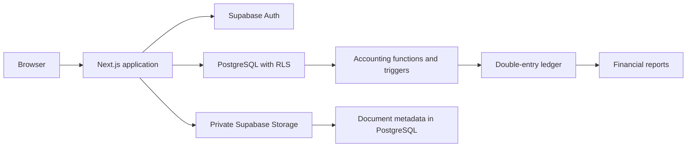
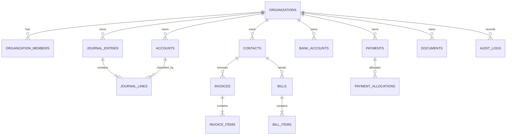
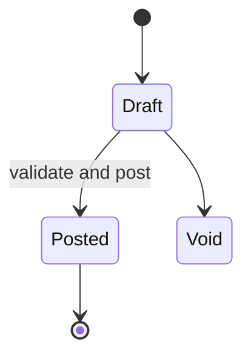
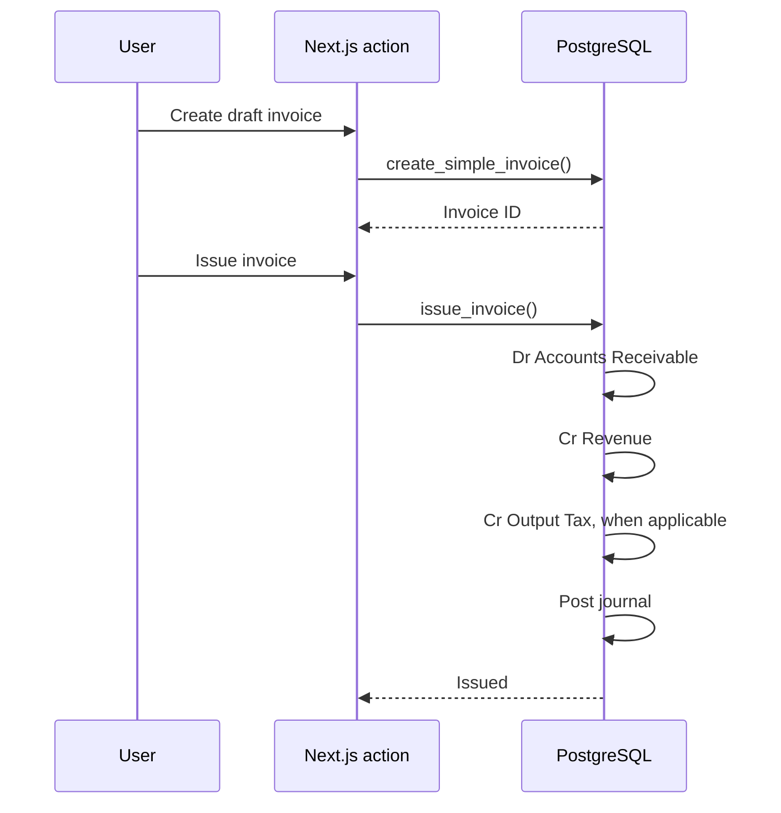
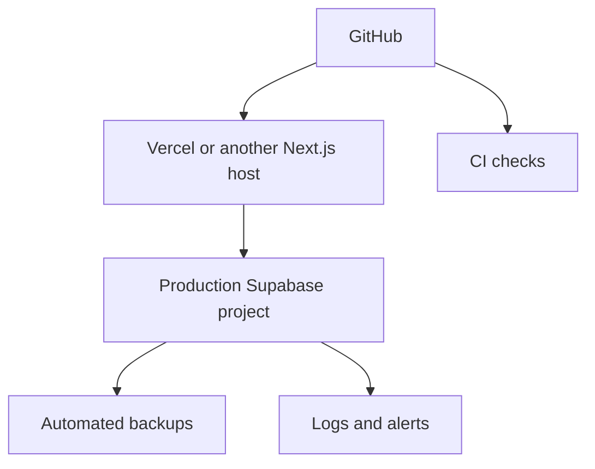

# System Architecture

## Goals

LedgerMY is designed around four requirements:

1. Financial integrity must be enforced in PostgreSQL, not only in the interface.
2. Every tenant must be isolated with row-level security.
3. Posted financial records must be immutable and auditable.
4. Supporting documents must remain private and accessible only through short-lived signed URLs.

## High-level architecture



The browser never receives a service-role credential. Authenticated requests use the user's Supabase session, and every table is protected by RLS.

## Application layers

### Presentation

Next.js Server Components render the authenticated workspace. Server Actions validate form input and call either:

- ordinary RLS-protected table operations for low-risk master data, or
- database RPC functions for accounting transactions that must be atomic.

### Authentication and session layer

The root `proxy.ts` refreshes Supabase sessions and redirects unauthenticated users away from protected routes. Server-side authorization rechecks the user and active organization before every protected page or action.

### Accounting domain layer

High-integrity operations are PostgreSQL functions:

- `create_manual_journal`
- `post_journal_entry`
- `create_simple_invoice`
- `issue_invoice`
- `create_simple_bill`
- `approve_bill`
- `record_invoice_payment`
- `record_bill_payment`

These functions run inside one database transaction and validate organization membership, permissions, account ownership, dates, amounts, and fiscal locks.

### Persistence layer

PostgreSQL stores:

- organizations and memberships
- accounts and contacts
- journal headers and lines
- invoices and invoice items
- bills and bill items
- payments and allocations
- bank accounts and imported bank transactions
- reconciliation matches
- document metadata
- fiscal locks
- audit events

### Document layer

Files are stored in a non-public Supabase bucket. The first storage path segment is the organization UUID:

```text
organization-id/random-uuid-original-name.pdf
```

Storage policies validate that folder against membership. The application creates five-minute signed links when rendering the document list.

## Tenant model



Every business table either contains `organization_id` directly or derives it through a protected parent.

## Roles

| Role | Intended access |
|---|---|
| Owner | Full company control, membership administration, period locks, bookkeeping |
| Admin | Company settings, period locks, bookkeeping |
| Bookkeeper | Accounts, contacts, journals, invoices, bills, payments, banking, documents |
| Viewer | Read-only financial access |

The current interface creates the owner automatically. Membership invitations should be added through a dedicated RPC or Edge Function rather than direct table writes.

## Journal lifecycle



A posted entry is immutable. Corrections should be made with a reversing journal, not by rewriting history.

### Posting validation

Before posting, PostgreSQL verifies:

- the user is owner, admin, or bookkeeper
- the period is open
- the entry is still a draft
- there are at least two journal lines
- total debit is positive
- total debit equals total credit

Line triggers also verify that referenced accounts and contacts belong to the same organization.

## Invoice flow



## Bill flow

Approval creates:

- debit expense accounts
- debit input tax when applicable
- credit Accounts Payable

## Payment flow

Customer receipt:

- debit selected bank ledger account
- credit Accounts Receivable

Supplier payment:

- debit Accounts Payable
- credit selected bank ledger account

The payment record and allocation link the cash movement back to the invoice or bill.

## Bank reconciliation model

`bank_transactions` accepts imported transactions with both `external_id` and `import_hash` uniqueness, allowing API or CSV imports to be idempotent. `reconciliation_matches` links an imported bank transaction to a posted journal.

The current interface exposes the model and bank-account setup. The import parser and matching workflow are roadmap items.

## Reporting

Reports are generated directly from posted journals:

- Trial balance
- Profit and loss
- Balance sheet
- Dashboard cash, receivable, payable, and current-month profit metrics

This avoids storing duplicate reporting balances that can drift from the ledger.

## Deployment recommendation



Use separate Supabase projects for development, staging, and production. Never reuse production secrets locally.
